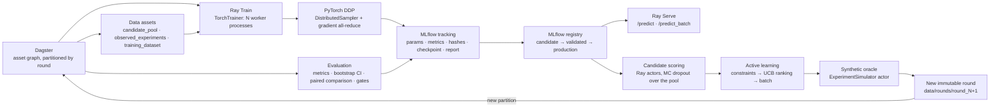

# bci-platform — a closed-loop research ML platform, demo-sized

The smallest credible internal research ML platform: **Dagster** orchestrates a
partitioned asset graph, **Ray** places the work, **PyTorch DDP** trains the
surrogate, **MLflow** records every run and gates the model registry, and
**Ray Serve** serves the production model. It runs on one laptop, CPU only, with
no cloud credentials and no Kubernetes, yet every layer is the real framework,
not a simulation of it. The same asset code runs against Docker Compose or
KubeRay by swapping resource configuration.

The workload is a synthetic stand-in for an expensive, noisy scientific
experiment: 100,000 candidates with 32 features each, a hidden nonlinear oracle
with heteroscedastic noise, 500 initial measurements and 100 new measurements
per round. The platform runs the scientific loop:

```text
data ──► model ──► decision ──► new data ──► model ...
round_000 → train (Ray Train + DDP) → evaluate + gate → register → score 100k candidates
         → constraints + acquisition → run 100 experiments on the oracle → round_001 (immutable)
```

The model is deliberately simple: a residual MLP with MC-dropout uncertainty.
The platform around it is the point of the demo.

---

## Quickstart

```bash
uv sync                          # creates .venv from uv.lock (Python 3.12 is fetched by uv if missing)
make test                        # unit + smoke tests, CPU only (~a few minutes)
make closed-loop                 # 3 closed-loop rounds through Dagster → Ray → DDP → MLflow
```

**Prerequisites:** [uv](https://docs.astral.sh/uv/) and `make`. uv installs
Python 3.12 automatically. You need no GPU, Docker, Kubernetes or cloud account.
The virtualenv is about 2 GB (torch, ray, dagster, mlflow, jax for notebook 13).
Generated state (`data/`, `reports/`, `artifacts/`, `mlflow.db`, `mlartifacts/`,
`dagster_home/`) takes tens of MB per round.

`make help` lists every target. Useful variables:
`CONFIG=configs/distributed.yaml`, `ROUNDS=5`, `FRESH=1` (wipe generated state
first), `RAY_ADDRESS=auto` (use a `make ray` head node instead of an ephemeral
local cluster).

| Target | What it does |
|---|---|
| `make install` / `make test` / `make test-smoke` / `make test-integration` | environment; test tiers (see [Testing](#testing-policy)) |
| `make lint` / `make format` / `make typecheck` / `make validate` | ruff, mypy, `dagster definitions validate` |
| `make mlflow` · `make dagster` · `make ray` / `make ray-stop` | UIs: MLflow :5000, Dagster :3000, Ray dashboard :8265 (long-running) |
| `make generate-data` | candidate pool + `round_000` via Dagster `bootstrap_job` (`scripts/bootstrap.py`) |
| `make train` | Ray Train DDP on the latest round union, evaluate, register, gate (`scripts/run_training.py`) |
| `make evaluate` | evaluate the production (else newest) model on the latest data (`scripts/run_evaluation.py`) |
| `make closed-loop` | `ROUNDS` rounds of `closed_loop_round_job` (`scripts/run_closed_loop.py`) |
| `make failure-demo` | worker failure → checkpoint recovery; experiments recorded, not re-run |
| `make serve` · `make query` · `make load-test` | Ray Serve on :8000 for the production model; client; load test |
| `make notebooks` | execute every notebook into `artifacts/notebooks/` |
| `make clean` | remove caches and all generated state |

---

## Architecture



Candidate scoring in the loop uses Ray actors (`inference/batch.py`) for
throughput. Ray Serve (`inference/serve.py`) is the online path for the same
registered model. Both load checkpoints with `Predictor.from_checkpoint`.

### Who owns what

| Layer | Owns | Why it is here | Where in the code |
|---|---|---|---|
| **Dagster** | *What* runs and *when*: asset dependencies, round partitions, retries, lineage, materialization metadata, sensor and schedule | Scientific datasets and models are durable assets with provenance, not steps of a script | `orchestration/assets.py`, `jobs.py`, `sensors.py`, `resources.py` |
| **Ray** (core) | *Where* work runs: tasks, actors, object store, resource requests, backpressure | Heterogeneous compute (CPU fan-out, stateful actors, GPUs) on one API from laptop to cluster | `ray_runtime/`, `inference/batch.py` |
| **Ray Train** | Gang-scheduling N training workers, process-group setup, checkpoint persistence, worker-group restart | Turns the DDP `Trainer` into a fault-tolerant distributed job without touching model code | `training/distributed.py` |
| **PyTorch DDP** | *How* replicas synchronize: one replica per process, sharded data, gradient all-reduce | The actual data-parallel training semantics | `training/trainer.py` |
| **MLflow** | Run metadata (params, metrics, hashes, artifacts) and the model registry lifecycle | Reproducibility and auditable promotion | `tracking/mlflow_client.py`, `tracking/registry.py` (the only modules that import mlflow) |
| **Ray Serve** | Online inference: replicas, dynamic batching, backpressure, rolling updates | Same Ray cluster and resource model as training | `inference/serve.py` |
| **Kubernetes / KubeRay** | Pods, node pools, GPUs, autoscaling, persistent storage in production | Optional; shows how the local topology maps to a cluster | `infra/k8s/` |

---

## Why Dagster + Ray?

They look like they overlap, since both "run things". They work at different
layers, and the code keeps the layers separate:

1. **Dagster knows what the science depends on.** It knows that
   *dataset A produces model B, which is evaluated by report C*, and it stores
   that lineage durably, per round, with retry policies and metadata. It has
   no idea how many GPUs a step uses.
   See `orchestration/assets.py`: each asset body binds ids, calls one step
   function from `orchestration/pipeline.py`, and returns metadata. The step
   functions receive infrastructure through `orchestration/resources.py`
   (`RayComputeResource`, `TrackingResource`, `RoundStoreResource`,
   `PlatformConfigResource`).
2. **Ray knows what the compute needs.** It knows that *training needs 2 (or 4
   GPU) workers gang-scheduled together, evaluation needs a fan-out of
   bootstrap tasks, and scoring needs a set of persistent model-cache actors.*
   It decides placement and knows nothing about lineage.
   See `ray_runtime/` (`ensure_ray`, `select_resources`, `parallel_bootstrap_ci`,
   `bounded_map`, `ExperimentSimulator`), `inference/batch.py`
   (`PredictorActor`) and `training/distributed.py` (`TorchTrainer`,
   `ScalingConfig`, `FailureConfig`).
3. **PyTorch DDP knows how gradients from rank 0 synchronize with ranks
   1…N.** See `training/trainer.py`: `DistributedDataParallel`,
   `DistributedSampler`, all-reduced metrics, rank-0-only checkpoints. It
   imports neither Ray nor Dagster and runs unchanged single-process, under
   `torchrun`, or inside Ray Train.

The boundary is enforced. The scientific packages (`data`, `models`,
`training/trainer.py`, `evaluation`, `active_learning`, `inference/predictor.py`)
must not import `ray`, `dagster` or `mlflow`, and
`tests/unit/test_logging_boundaries.py` checks this. Dagster runs with an
in-process executor: steps of a round run in one process, and parallelism comes
from Ray, not from Dagster subprocesses.

---

## Asset lineage

```text
candidate_pool ─► observed_experiments ─► training_dataset ─► trained_model ─► evaluation_report
   (static)          [round_r]              [round_r]          [round_r]         [round_r]
                                                                  │                   │
                                                                  ▼                   ▼
new_experimental_results ◄─ selected_experiments ◄─ candidate_predictions ◄─ registered_model
  [round_r] writes round_{r+1} and registers that partition
```

| Asset | Kind | Retry | Output / durable store |
|---|---|---|---|
| `candidate_pool` | unpartitioned | none (write-once) | `data/candidate_pool/{pool.parquet,manifest.json}` |
| `observed_experiments` | round | `LIGHT_RETRY` | `data/rounds/round_XXX/{observations.parquet,manifest.json}` |
| `training_dataset` | round | `LIGHT_RETRY` | union of `round_000..round_r`, validated; id = hash chain |
| `trained_model` | round | `COMPUTE_RETRY` | Ray Train DDP run, MLflow run, `artifacts/ray_train/<run>/epoch_XXXX/` |
| `evaluation_report` | round | `COMPUTE_RETRY` | `reports/round_XXX/<mlflow_run_id>/` + MLflow `evaluation/` artifacts |
| `registered_model` | round | `LIGHT_RETRY` | MLflow model version, lifecycle tag + aliases |
| `candidate_predictions` | round | `COMPUTE_RETRY` | `artifacts/predictions/round_XXX/v<version>/{predictions.parquet,stats.json}` |
| `selected_experiments` | round | `LIGHT_RETRY` | `data/selections/round_{r+1}/<hash12>/{selected.parquet,selection.json}` |
| `new_experimental_results` | round | **none** | `data/rounds/round_{r+1}/` + lab journal `data/lab_journal/measurements.jsonl` |

* **Partitions.** Experimental rounds are Dagster *dynamic* partitions
  (`orchestration/partitions.py`). Nobody knows in advance how many rounds a
  campaign will have. Partition keys equal RoundStore directory names.
* **Closing the loop.** A static edge from `new_experimental_results` back to
  `observed_experiments` would form a cycle. The RoundStore is the hand-off
  point, as it would be with a real lab: `new_experimental_results[round_r]`
  writes `round_{r+1}` and registers the partition. Then
  `scripts/run_closed_loop.py`, or the `new_round_sensor` if you enable it in
  the UI, materializes the next round.
* **Jobs, sensor and schedule.**
  * Jobs: `bootstrap_job`, `closed_loop_round_job` and `retrain_job`.
  * `new_round_sensor` polls the RoundStore and is capped by `MERGE_MAX_ROUND`
    (default 5).
  * `nightly_retrain_schedule` retrains the latest round nightly.
  * The sensor and the schedule are both STOPPED by default.
* **Retry policies** (`assets.py`).
  * `COMPUTE_RETRY` (2 retries, exponential backoff with jitter) covers
    deterministic, idempotent compute that a lost Ray worker or object-store
    pressure can break.
  * `LIGHT_RETRY` covers cheap I/O steps.
* **Why `new_experimental_results` never auto-retries.** This step stands for a
  *physical experiment*: it costs money and time, and its noise cannot be
  reproduced. A human should look at a failure before anything re-runs it.
  Safety comes from idempotency instead:
  * the `ExperimentSimulator` actor journals each measurement per
    `(round_id, candidate_id)`, so a replayed request returns the recorded
    value;
  * the RoundStore is write-once;
  * a manual re-materialization with the same selection is a no-op;
  * one with a different selection raises `ImmutableRoundError`.

---

## Data model and reproducibility

* **`ExperimentRecord`** (`data/schema.py`, pydantic, frozen): `experiment_id`,
  `round_id`, `features`, `response`, `measurement_std`,
  `status ∈ {candidate, selected, measured, failed}`, `created_at`,
  `provenance`.
* **Immutable rounds** (`data/datasets.py::RoundStore`): each round is written
  once and its files are made read-only.
  * Writing identical content again is a no-op, which makes orchestration
    retries safe.
  * Writing different content raises `ImmutableRoundError`.
  * Gaps and duplicates in the round chain raise `RoundSequenceError`.
  * The training set is always `training_frame(up_to_round=r)` =
    `union(round_000..round_r)`, which gives point-in-time reproducibility.
* **Hash chain.** A `RoundManifest` holds:
  * `dataset_hash`: a content hash of the scientific columns only, so a
    retried write hashes identically;
  * `parent_hashes`: the previous round's `manifest_hash`;
  * `provenance`: `selection_hash`, the model version and role that chose the
    batch, and the lab.

  A training dataset's id is the manifest hash of its last round, so it commits
  transitively to every earlier round. `RoundStore.verify_chain()` re-hashes
  everything.
* **What MLflow stores per training run** (`Tracker.log_train_result`):
  * params: hyperparameters, seed, `world_size`, device, `n_train`/`n_val`,
    `dataset_id`;
  * per-epoch metrics and `duration_s`;
  * tags: `dataset_hash`, `config_hash`, `git_sha`, `checkpoint_hash`,
    environment and device info, `ray.ray_job_id`, `ray.failures_recovered`,
    `ray.restored_from_epoch`;
  * the dataset as an MLflow input, plus `config.json`, `train_result.json`
    and the checkpoint;
  * `log_evaluation` adds the `eval_*` metrics, `gate_passed`/`gate_reasons`
    tags and the `evaluation/` report files.
* **Determinism.** Seeded data, a deterministic hash-based train/val split
  (`val_strategy: hash`, stable across rounds so round-to-round comparisons are
  fair), deterministic PyTorch where the kernels allow it, RNG state in
  checkpoints, and per-shard MC-dropout seeds.

All hashes are SHA-256 over canonical serializations (`hashing.py`).

---

## Distributed training

*Ray decides where workers run. PyTorch DDP decides how model replicas
synchronize gradients.*

* `training/distributed.py::train_distributed` builds a Ray Train
  `TorchTrainer` with a `ScalingConfig` from `ray_runtime.resources.select_resources`.
  * Ray reserves one placement group for all N workers (gang scheduling),
    starts one process per rank, and initializes the process group (gloo on
    CPU, nccl on CUDA).
  * The driver `ray.put`s the train/val frames once, so every rank reads
    byte-identical data.
* Inside each worker, the unmodified `training/trainer.py::Trainer` wraps the
  model in `DistributedDataParallel`, shards data with `DistributedSampler`,
  all-reduces validation metrics, and writes checkpoints on rank 0 only.
* **Checkpoints** hold model, optimizer, epoch, metrics, normalizer, config,
  RNG state and model spec (`training/checkpointing.py`).
  * They are reported every epoch and persisted to
    `artifacts/ray_train/<run>/epoch_XXXX/`; the newest few are kept.
  * At the end, ranks `all_gather` their pid, host and parameter digest.
    Identical digests prove the replicas stayed in sync; they appear as
    `worker_pids` / `params_in_sync` in Dagster metadata.
* **Resources.** `use_gpu: auto` means CUDA is actually usable. Ray's raw GPU
  count is not trusted, because on Apple silicon Ray advertises a Metal GPU
  that DDP/NCCL cannot use. `configs/local.yaml` and `configs/distributed.yaml`
  run 2 CPU workers. `configs/gpu.yaml` runs one worker per GPU.
* **Failure and recovery:** `make failure-demo` (`scripts/demo_failure_recovery.py`).
  * Part 1: `SimulatedWorkerFailure` is raised after the epoch-3 checkpoint.
    `FailureConfig(max_failures=1)` restarts the worker group, the workers
    call `ray.train.get_checkpoint()` and resume at epoch 4 with the restored
    optimizer and RNG state, and the final checkpoint loads.
  * Part 2: a retried `measure()` on the `ExperimentSimulator` returns the
    recorded measurement, even after the actor process is killed, and
    re-writing a round is a no-op or is rejected.
  * You can also run `uv run python scripts/run_training.py --fail-at-epoch 3`.

## Evaluation and gates

`evaluation/` is a first-class package with no framework imports.

* **Metrics** (`metrics.py`): MAE, RMSE, R², Gaussian NLL, 95% interval
  coverage (MC dropout), plus slice metrics by round.
* **Uncertainty.** `bootstrap_ci` gives a 95% CI on RMSE. The pipeline also
  computes the same CI with parallel Ray tasks (`ray_runtime.tasks.parallel_bootstrap_ci`)
  to show task fan-out.
* **Paired comparison** (`comparison.py::paired_compare`): the candidate and
  the baseline are scored on the *same* validation rows with the *same*
  bootstrap indices, so example difficulty cancels out.
  * The baseline is the current production model.
  * With no production model, the baseline is a train-mean predictor, which
    never sees the evaluation set.
* **Gates** (`evaluator.py::check_gates`, `configs/*.yaml`):
  ```yaml
  evaluation:
    max_rmse: 0.35                     # standardized RMSE (targets z-scored with training stats)
    min_improvement_vs_baseline: 0.02  # relative RMSE improvement vs the baseline
  ```
* **Outputs:** `reports/round_XXX/<mlflow_run_id>/{metrics.json, report.md, predictions.parquet, comparison.json}`.
  The same files are logged to the MLflow run under `evaluation/`.
  `scripts/run_evaluation.py` writes ad-hoc evaluations to
  `reports/round_XXX/eval_<model>_<timestamp>/`.

A model that fails a gate **stays `candidate`**: it is registered and available
for research, but it is never served.

## Model lifecycle

`tracking/registry.py::ModelRegistry` combines MLflow aliases with a
`lifecycle` version tag:

```text
register() ─► candidate ──gate passed──► validated ─► production ──superseded──► archived
                  └── gate failed: stays candidate (+ gate_passed=false, gate_reasons tags)
```

* Promotion happens only through `promote_if_passed(version, gate)`. Finishing
  training never promotes a model, and
  `set_stage(v, "validated"|"production")` refuses versions without a recorded
  passing gate.
* The aliases `candidate`, `validated` and `production` point at the newest
  version in each state, so consumers resolve `models:/merge-surrogate@production`.
* The registered artifact is an `mlflow.pyfunc` wrapper around the
  framework-free `Predictor` and carries the raw checkpoint, so Ray Serve loads
  it without MLflow.
* **Decision policy** (`pipeline.choose_scoring_model`): candidates are scored
  with the production model if one exists. Otherwise the round's own model
  scores them, flagged `research-candidate`. It can steer *which experiments to
  run next*, but it is never served. `make serve` refuses to start without a
  production model.

## Active learning

* **Acquisition** (`active_learning/acquisition.py`): the default is
  `ucb = predicted_mean + beta * predictive_std` (MC dropout). EI, Thompson,
  greedy and pure-uncertainty strategies are also implemented.
* **Constraints** (`active_learning/constraints.py`) are composable callables
  that filter candidates *before* ranking: `FeatureBounds`, `MaxCost` and
  `ExcludeIds` (already measured). They encode lab knowledge and live apart
  from the model; `cfg.active_learning` configures them.
* **Selection** (`active_learning/loop.py::select_batch`) is deterministic, with
  ties broken by `candidate_id`, and has an optional diversity radius.
  * `selection_hash` commits to the round, the model version, the acquisition
    settings, the constraints and the selected rows.
  * `write_selection` persists `selected.parquet` + `selection.json` under
    `data/selections/round_{r+1}/<hash12>/`. This is the versioned artifact
    that the lab (`new_experimental_results`) consumes.
* Selection bias is real: actively acquired rounds are not a random sample.
  `round_000` remains the unbiased reference. See the `loop.py` docstring and
  notebook 09.

## Serving

`make serve` resolves the `production` alias from the registry and starts
`python -m bci_platform.inference.serve --checkpoint <path> --model-version <v>`.

| Endpoint | Body / response |
|---|---|
| `POST /predict` | `{"features": [32 floats]}` → `{mean, std, model_version}` |
| `POST /predict_batch` | `{"features": [[32 floats], ...]}` → `{predictions: [...], model_version}` |
| `GET /health` | `{status, model_version}` |
| `GET /model-info` | version, checkpoint hash, #params, live metrics (requests, batch-size histogram, p50/p95/p99) |

Try `make query`, `make load-test`, or
`uv run python scripts/load_test.py --concurrency 1` against `--concurrency 64`
to watch dynamic batching trade latency for throughput.

* **Batching.** `/predict` goes through `@serve.batch`: concurrent single
  requests that arrive within `batch_wait_timeout_s` (10 ms) are stacked into
  one MC-dropout forward pass of up to `max_batch_size` (64) rows.
  `/predict_batch` bypasses the batcher and chunks its input.
* **Replicas.** `serve.num_replicas` sets the count. Each replica is a Ray
  actor that loads the checkpoint once in `__init__`. The model call runs in a
  worker thread, so the event loop keeps accepting and batching requests.
* **CPU/GPU resource assignment.** `replica_resources()` derives `num_cpus`
  from the cluster and requests `num_gpus` (fractional when several replicas
  share a GPU) only when CUDA exists.
* **Backpressure.** `max_ongoing_requests` caps in-flight requests per replica
  (≥ `max_batch_size`, so a full batch can form). Excess requests queue at the
  proxy. Beyond `max_queued_requests`, Serve returns HTTP 503 so latency does
  not grow without bound.
* **Autoscaling.** `build_app(..., autoscaling=True)` or an
  `autoscaling_config` scales replicas on `target_ongoing_requests`.
  `infra/k8s/rayservice.yaml` shows the cluster version.
* **Model loading.** Serving receives a checkpoint path and version, and the
  registry decides which checkpoint that is, so `serve.py` never imports
  MLflow. On a multi-node cluster the checkpoint must be on shared storage or
  baked into the image.
* **Rolling model replacement.** Redeploy the same application name with the
  new checkpoint and version (`serve.run(build_app(...), name="surrogate")`,
  `serve deploy`, or a `RayService` update). Serve starts new replicas, waits
  for health checks, shifts traffic, and drains the old ones.
  `/model-info` shows which version answered.

## Retrying computation vs re-running an experiment

| | Computation (training, scoring, bootstrap, I/O) | Scientific experiment (`new_experimental_results`) |
|---|---|---|
| Nature | deterministic or idempotent; cheap to redo | costs money and time; the noise cannot be reproduced |
| Dagster | `COMPUTE_RETRY` / `LIGHT_RETRY` | **no retry policy**; a human inspects failures |
| Ray | task `max_retries`, actor `max_restarts=1`, Ray Train `FailureConfig` + checkpoint resume | `ExperimentSimulator`: `max_task_retries=0`, journaled per `(round, candidate)` |
| Storage | outputs overwritten by identical results | write-once RoundStore: identical content is a no-op, different content raises `ImmutableRoundError` |

Notebook 11 and `make failure-demo` walk through both halves.

## Observability

* **Structured logs** (`bci_platform/logging.py`, structlog). Every log line
  carries the correlation ids that apply:
  * `run_id`: the Dagster run, or the MLflow run in training;
  * `round_id`, `dataset_id`, `model_version` and `ray_job_id`;
  * `rank`, `world_size` and `pid` inside DDP workers.

  Assets bind the ids with `bound_ids(...)` (contextvars).
  `MERGE_LOG_FORMAT=json` prints one JSON object per line.
  `MERGE_LOG_LEVEL` sets the level.
* **Local views.**
  * Dagster: asset metadata such as MLflow links, hashes, worker pids and gate
    reasons.
  * MLflow: runs and the registry.
  * Ray dashboard: tasks, actors, placement groups, logs.
  * Serve: `/model-info`.
* **Production mapping** (details in [`infra/k8s/README.md`](infra/k8s/README.md#observability-mapping)):
  * Prometheus scrapes Ray node metrics, including the Serve request, latency
    and batch-size metrics emitted by `serve.py`, and the MLflow server.
  * Grafana shows Ray's generated dashboards plus DCGM GPU panels.
  * OpenTelemetry traces a request or a closed-loop round across Serve and the
    Dagster run pods.
  * Central log storage (Loki, Elasticsearch or Cloud Logging) collects the
    JSON logs, and the shared ids join a Dagster run, its Ray job and its
    MLflow run in one query.

---

## Docker Compose and local → Kubernetes / KubeRay

Docker is optional. `docker compose up --build -d` starts `ray-head`,
`ray-worker` (scalable with `--scale ray-worker=3`), `ray-worker-gpu`
(`--profile gpu`), `dagster-webserver`, `dagster-daemon` and `mlflow`, all from
one image built from `uv.lock`.
* Dagster reaches Ray through `RAY_ADDRESS=ray://ray-head:10001`.
* Shared volumes stand in for a shared filesystem.
* SQLite and local artifacts keep it self-contained.

See [`infra/docker/README.md`](infra/docker/README.md).

[`infra/k8s/`](infra/k8s/README.md) holds reference manifests (none of them
are needed for the demo). Each local piece maps to a cluster piece:

| Local | Kubernetes / KubeRay |
|---|---|
| `ray.init()` local cluster / `make ray` | `RayCluster` (`raycluster.yaml`): head (`num-cpus: 0`), autoscaled CPU group (1..10), GPU group (0..4, scale-to-zero) |
| `make train` | `RayJob` (`rayjob.yaml`) on an ephemeral cluster |
| `make serve` | `RayService` (`rayservice.yaml`): Serve autoscaling, blue/green upgrades |
| `make dagster` | Dagster Helm chart (`dagster-values.yaml`); run pods use `RAY_ADDRESS=ray://…-head-svc:10001` |
| `mlflow.db` (SQLite), `dagster_home/` SQLite | **Postgres** for the MLflow backend store and Dagster run/event storage |
| `data/`, `artifacts/`, `mlartifacts/` on local disk | **Object storage** (S3/GCS) or an RWX PVC: Ray Train `storage_path`, MLflow `--artifacts-destination`, round store |

* **Node selectors.** `merge.io/pool` selects one of three pools:
  * `system`: on-demand, runs Dagster, MLflow and the Ray head;
  * `cpu`: Ray CPU workers, spot preferred;
  * `gpu`: tainted `nvidia.com/gpu`.
* **GPU pools.** GPU workers set `nvidia.com/gpu` requests equal to limits, so
  Ray advertises exactly the GPUs the kernel enforces.
* **Autoscaling** has three layers: Ray Serve replicas, then the KubeRay
  autoscaler (pending Ray demand becomes pods), then Cluster Autoscaler or
  Karpenter (pending pods become nodes).
* **Spot/preemptible nodes** are safe for CPU workers because the compute is
  retryable and checkpoints live on shared storage. The Ray head, Dagster,
  MLflow and Serve stay on-demand.
* **Persistent artifact storage** must be shared by every Ray worker and
  Dagster run pod. That is why rounds, checkpoints and reports use shared paths
  rather than node-local disk.

---

## Notebooks

Each notebook covers a concept, a small derivation, a runnable example, the
link to this repo's code, failure modes and an exercise. Run them all with
`make notebooks`. Generators live in `notebooks/_build/`.

| # | Notebook | Topic |
|---|---|---|
| 00 | `00_system_map` | Lifecycle; data/compute/control/metadata/serving planes; what each framework owns |
| 01 | `01_pytorch_training_foundations` | Tensors, autograd, modules, a manual training loop, checkpoint state, mixed precision |
| 02 | `02_distributed_training_ddp` | Ranks, process groups, DistributedSampler, gradient all-reduce, effective batch size |
| 03 | `03_ray_distributed_execution` | Tasks, actors, ObjectRefs, object store, scheduling, backpressure, fault handling |
| 04 | `04_ray_train_and_resource_management` | Ray Train ↔ DDP, worker groups, placement, GPU assignment, checkpoint/retry |
| 05 | `05_dagster_scientific_workflows` | Assets vs jobs, resources, partitions, sensors, lineage, retries; Dagster vs Ray scheduling |
| 06 | `06_experiment_tracking_and_reproducibility` | Run identity, hashes, registry; reproduce a model from stored metadata |
| 07 | `07_model_evaluation_and_statistics` | Paired evaluation, bootstrap CIs, calibration, slices, leakage, thresholds |
| 08 | `08_distributed_inference` | Batch scoring vs online serving, dynamic batching, P50/P95/P99, backpressure |
| 09 | `09_active_learning_and_closed_loop_optimization` | Exploration/exploitation, acquisition functions, constraints, selection bias |
| 10 | `10_sparse_noisy_scientific_data` | Aleatoric vs epistemic, heteroscedastic noise, replicates, leaky splits |
| 11 | `11_fault_tolerance_and_distributed_systems` | At-most/at-least-once, idempotency, checkpoints; retrying compute vs experiments |
| 12 | `12_gpu_and_kubernetes_resource_orchestration` | Requests/limits, node pools, taints, autoscaling, KubeRay mapping |
| 13 | `13_jax_and_pytorch_execution_models` | Eager vs JIT, functional transforms, vmap; the same model in both frameworks |

## Repository layout

```text
.
├── Makefile  pyproject.toml  uv.lock  docker-compose.yml  .env.example  .pre-commit-config.yaml
├── configs/            local.yaml · distributed.yaml · gpu.yaml   (pydantic-validated, `extends:`)
├── src/bci_platform/
│   ├── config.py  hashing.py  logging.py
│   ├── data/            schema · synthetic_oracle · generation · validation · normalization · datasets (RoundStore)
│   ├── models/          mlp (ResidualMLP) · losses · uncertainty (MC dropout)
│   ├── training/        trainer (DDP-aware) · distributed (Ray Train) · checkpointing · config
│   ├── evaluation/      metrics · comparison · evaluator (gates) · reporting
│   ├── inference/       predictor (pure) · batch (Ray actors) · serve (Ray Serve)
│   ├── active_learning/ acquisition · constraints · loop
│   ├── tracking/        mlflow_client (Tracker) · registry (ModelRegistry)   ← only mlflow importers
│   ├── ray_runtime/     cluster (ensure_ray) · resources (select_resources) · tasks (tasks + ExperimentSimulator)
│   └── orchestration/   pipeline (step functions, RayCompute) · assets · resources · jobs · sensors · partitions · definitions
├── scripts/            bootstrap · run_training · run_evaluation · run_closed_loop · demo_failure_recovery · query_model · load_test
├── notebooks/          00–13 *.ipynb  +  _build/ (generators)
├── tests/              unit/ · smoke/ · integration/
├── infra/docker/       Dockerfile · dagster.yaml · workspace.yaml · healthcheck.py
├── infra/k8s/          raycluster.yaml · rayjob.yaml · rayservice.yaml · dagster-values.yaml · README.md
├── .github/            workflows/ci.yml · actions/setup-env
└── docs/               HANDOFF.md (spec) · PLAN.md (module contracts)
generated (git-ignored): data/ reports/ artifacts/ mlflow.db mlartifacts/ dagster_home/
```

## Testing policy

| Marker | Scope | Run with | In CI |
|---|---|---|---|
| (none) | fast unit tests: determinism, schema, immutability, model, checkpoints, metrics, gates, acquisition, Dagster definitions load, import boundaries | `make test` | `unit-tests` |
| `smoke` | quick end-to-end: Ray tasks, batch inference, 2-round closed loop | `make test-smoke` (also in `make test`) | `ray-smoke` |
| `integration` | 2-worker DDP, Ray Train + recovery, Ray Serve, Dagster closed loop | `make test-integration` | opt-in (`workflow_dispatch`) |
| `gpu` | needs CUDA | `uv run pytest -m gpu` | opt-in, self-hosted GPU runner |

`pyproject.toml` deselects `integration` and `gpu` by default. CI
(`.github/workflows/ci.yml`) runs `lint` (ruff), `typecheck` (mypy),
`unit-tests`, `ray-smoke` and `dagster-validate` on every PR, CPU only.

---

## Closed-loop summary (example output)

`make closed-loop FRESH=1 ROUNDS=3` on a laptop CPU with 2 DDP workers. Numbers
vary slightly by machine.

```text
round      observations  model version    val RMSE*  gate  decisions by           top score  #selected  wrote      elapsed s
round_000  500           v1 (candidate)   0.3822     fail  v1 research-candidate  6.8132     100        round_001  31.7
round_001  600           v2 (production)  0.3037     pass  v2 production          6.8688     100        round_002  28.3
round_002  700           v3 (production)  0.2792     pass  v3 production          6.3379     100        round_003  26.6

* validation RMSE in standardized units (the gated metric; gate: <= max_rmse and improvement vs baseline).
```

Round 0 fails the `max_rmse` gate: 500 noisy points are not enough. It stays a
candidate, but it still chooses round 1's experiments as a
*research-candidate*. With 100 targeted measurements, v2 passes and becomes
production. v3 beats v2 in a paired comparison on the same rows, and v2 is
archived.

---

## Five-to-ten-minute demonstration

`make mlflow`, `make dagster` and `make serve` run until you stop them. Give
each one its own terminal.

```bash
uv sync                                   # 1. environment
make test                                 # 2. CPU test suite
make mlflow                               # 3. terminal A: MLflow UI  → http://localhost:5000
make dagster                              # 4. terminal B: Dagster UI → http://localhost:3000
make closed-loop                          # 5. terminal C: 3 rounds (add FRESH=1 to start clean)
make serve                                # 6. terminal D: Ray Serve of the production model → :8000
uv run python scripts/query_model.py      # 7. terminal C: /health, /model-info, /predict, /predict_batch
```

Optional: run `make ray` first and prefix the commands with `RAY_ADDRESS=auto`
to watch the work in the Ray dashboard. Run `make failure-demo` for
checkpoint recovery.

**Where to inspect**

* **Dagster asset lineage**: http://localhost:3000. Open *Assets → closed_loop
  group → lineage graph*, then the *Partitions* tab (`round_000`, `round_001`,
  …). Each materialization's metadata shows hashes, the MLflow run link, DDP
  `worker_pids`, gate reasons and the top-10 selection. *Runs* shows one
  `closed_loop_round_job` per round.
* **Ray worker execution**: `make ray`, then
  `RAY_ADDRESS=auto make closed-loop`, then http://localhost:8265 (Jobs,
  Actors, placement groups, per-worker logs). Without the dashboard, the
  console log lines carry `rank`, `world_size` and `pid` from each DDP worker.
* **MLflow experiment history**: http://localhost:5000, experiment
  `merge-closed-loop`. Runs have per-epoch metrics, params, the dataset input,
  hash tags, and the `checkpoint/` and `evaluation/` artifacts.
* **Evaluation reports**: `reports/round_XXX/<mlflow_run_id>/` with
  `report.md`, `metrics.json`, `comparison.json` and `predictions.parquet`.
* **Model registry**: MLflow → *Models* → `merge-surrogate`. Look at the
  `production` / `validated` / `candidate` aliases and the `lifecycle`,
  `gate_passed` and `gate_reasons` tags per version.
* **Selected experimental candidates**:
  `data/selections/round_XXX/<selection_hash12>/selected.parquet` and
  `selection.json`. The rounds they became are
  `data/rounds/round_XXX/{observations.parquet, manifest.json}`, whose
  `provenance` includes the `selection_hash`.
* **Ray Serve endpoint**: http://localhost:8000/health and `/model-info`, or
  `make query` / `make load-test`.
