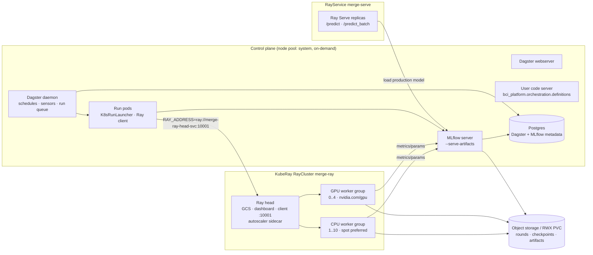

# Kubernetes / KubeRay reference deployment

These manifests show how the local demo maps onto a production cluster. They
are examples: the demo itself needs no Kubernetes. Image
`ghcr.io/your-org/bci-platform:0.1.0` is the image built from
`infra/docker/Dockerfile`; replace the registry, node-pool labels and storage
class with your own.

| File | What it is |
|------|------------|
| `raycluster.yaml` | Long-lived `RayCluster`: head + autoscaled CPU worker group + GPU worker group (scale-to-zero), plus the shared RWX `PersistentVolumeClaim`. |
| `rayjob.yaml` | `RayJob`: runs `python scripts/run_training.py --config configs/distributed.yaml` on an ephemeral cluster that is deleted afterwards. |
| `rayservice.yaml` | `RayService`: Ray Serve app `bci_platform.inference.serve:app`, with blue/green cluster upgrades. |
| `dagster-values.yaml` | Helm values sketch for the Dagster control plane (`dagster/dagster` chart), pointing at the Ray cluster via `RAY_ADDRESS`. |

## Topology



Responsibilities are the same as locally: Dagster decides *what* to
materialize and records lineage; Ray decides *where* each task/actor/worker
runs; PyTorch DDP decides *how* gradients synchronize; MLflow stores run and
model metadata; Ray Serve executes inference.

## Where each concern lives

**Node selectors and pools.** Three pools, selected with `merge.io/pool`:
`system` (on-demand, no GPU: Dagster, MLflow, Ray heads), `cpu` (Ray CPU
workers, may be spot), `gpu` (tainted `nvidia.com/gpu:NoSchedule`; only pods
that tolerate it, i.e. the GPU worker group, land there). Serving uses
`cpu-ondemand` so latency-sensitive replicas are never preempted.

**GPU pools.** The GPU worker group requests and limits `nvidia.com/gpu: 1`
(requires the NVIDIA device plugin / GPU operator). Ray detects the GPU from the
limit and advertises `GPU: 1`, so `ScalingConfig(use_gpu=True)` and
`@ray.remote(num_gpus=1)` schedule onto these pods. Requests equal limits
(Guaranteed QoS) so Ray's resource view matches what the kernel enforces.

**Autoscaling (three layers).**
1. Ray Serve autoscaling changes the replica count from queue depth
   (`autoscaling_config` in `rayservice.yaml`).
2. The KubeRay in-tree autoscaler (`enableInTreeAutoscaling: true`) turns
   pending Ray resource demand into worker pods between `minReplicas` and
   `maxReplicas`. The GPU group has `minReplicas: 0`, so no GPUs are billed when
   idle; `idleTimeoutSeconds: 120` scales them back down.
3. Cluster Autoscaler / Karpenter / GKE node auto-provisioning adds nodes for
   pending pods.

**Spot / preemptible nodes.** CPU workers prefer spot via
`preferredDuringSchedulingIgnoredDuringExecution` node affinity and a spot
toleration. This is safe because the work is retryable: Ray retries failed
tasks, and Ray Train restores DDP training from the last checkpoint
(`FailureConfig(max_failures>0)`), which lives on shared storage. The Ray head,
Dagster, MLflow and Serve replicas stay on on-demand capacity. Retrying
*computation* is cheap; the physical *experiment* is never re-run by a retry,
because experimental rounds are write-once, versioned materializations.

**Persistent artifact storage.** Every Ray worker and Dagster run pod must see
the same rounds and checkpoints. The example mounts a ReadWriteMany PVC
(`merge-shared`: EFS / Filestore / Azure Files) at `/app/data`,
`/app/reports`, `/app/artifacts`. The preferred production setup is object
storage: Ray Train `RunConfig(storage_path="s3://…")`, MLflow
`--artifacts-destination s3://…`, round store on a bucket.

**Postgres.** Replaces SQLite in two places: Dagster run/event/schedule storage
(`postgresql.*` in `dagster-values.yaml`) and the MLflow backend store
(`--backend-store-uri postgresql://…`). Use a managed instance with backups;
both hold durable lineage and registry state.

**Resource requests and limits.** Every Ray container sets CPU/memory requests
equal to limits; the head uses `num-cpus: "0"` so no training or eval work
lands on it. `/dev/shm` is a memory-backed `emptyDir` for the Ray object store
and DataLoader workers.

## Observability mapping

| Local demo | Production |
|------------|------------|
| Ray dashboard (:8265) | Same dashboard behind auth, with its Grafana panels embedded. |
| `--metrics-export-port=8080` on every Ray node | Prometheus scrapes port `metrics` (8080) on head and worker pods, via a `PodMonitor` selecting `ray.io/cluster` (Prometheus Operator) or scrape annotations. Ray Serve request count/latency/queue metrics come through the same endpoint. |
| Ray-generated Grafana dashboards (`/tmp/ray/session_latest/metrics/grafana`) | Import into Grafana; add panels for training throughput, GPU utilization (DCGM exporter), Serve P50/P95/P99. |
| MLflow `--expose-prometheus` (optional) | Scraped by the same Prometheus. |
| Dagster UI run/asset history | Dagster UI + run-failure sensors to Slack/PagerDuty; Postgres holds history. |
| structlog JSON logs with `run_id`, `round_id`, `dataset_id`, `model_version`, `ray_job_id` | Stdout collected by Fluent Bit / Vector / Promtail into Loki, Elasticsearch or Cloud Logging; the shared fields let one query join a Dagster run, its Ray job and the MLflow run. |
| — | OpenTelemetry: Ray Serve and the Dagster run pods export traces via OTLP to a collector (Tempo / Jaeger / vendor), so one prediction request or one closed-loop round is a single trace. |

## Deploying (sketch)

```bash
kubectl create namespace merge
helm repo add kuberay https://ray-project.github.io/kuberay-helm/
helm install kuberay-operator kuberay/kuberay-operator -n merge
kubectl -n merge apply -f infra/k8s/raycluster.yaml
helm repo add dagster https://dagster-io.github.io/helm
helm upgrade --install dagster dagster/dagster -n merge -f infra/k8s/dagster-values.yaml
kubectl -n merge apply -f infra/k8s/rayservice.yaml
kubectl -n merge apply -f infra/k8s/rayjob.yaml          # ad-hoc retraining
```

MLflow and Postgres are not included here; run MLflow as a Deployment (same
image, `mlflow server --backend-store-uri postgresql://… --artifacts-destination s3://…`)
exposed as Service `mlflow` on port 5000, the address the manifests assume.

Keep `rayVersion` in the manifests in sync with the Ray version in `uv.lock`
(currently 2.58.0).
